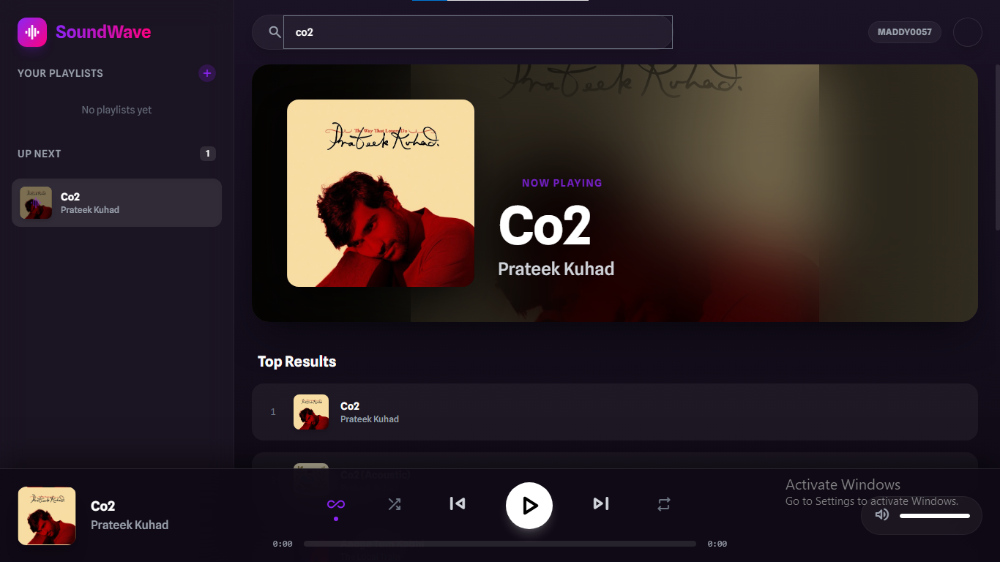
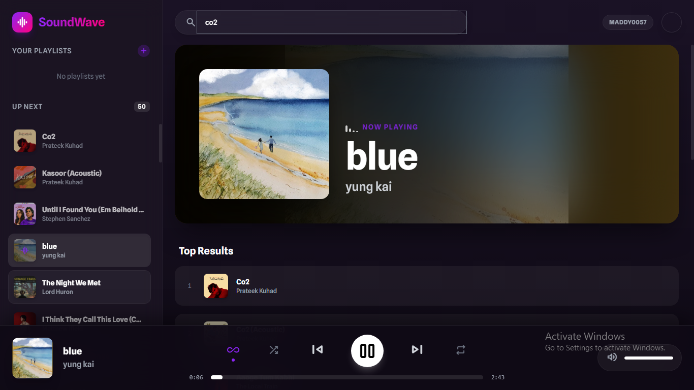

<div align="center">

# 🎵 **SoundWave Premium**
### **The Ultimate Open-Source Music Experience**


<br />

> **"Stop renting your music. Start owning the vibe."**
>
> A stunning, self-hosted Python Music Player and Flask Web App that streams **High-Fidelity Audio** directly from YouTube Music — **Ad-Free Streaming. Zero Tracking. Infinite Play.**

[**View Demo**](#) · [**Report Bug**](https://github.com/Maddy0057/SoundWave/issues) · [**Request Feature**](https://github.com/Maddy0057/SoundWave/issues)

</div>

---

## 🔥 **Why SoundWave?**

Most open-source music players are command-line only or lack visual polish. **SoundWave** changes the game. It combines a **Next-Gen Glassmorphism UI** with robust Python engineering to deliver a Spotify-like experience for free.

### 🚀 **Killer Features**

- **♾️ Smart Infinite Autoplay**
  - When your queue ends, our smart algorithm fetches **20+ similar songs** automatically based on the last track.
- **🚫 Ad-Free High-Fidelity Streaming**
  - We stream pure, high-quality audio (m4a) using `yt-dlp` with seamless redirects.
- **🖼️ Crystal Clear HD Visuals**
  - Forced `maxresdefault` thumbnails for crisp, retina-ready album art on every track.
- **🎨 Stunning Glass UI**
  - Desktop-first interface built with **TailwindCSS** (CDN), smooth animations, and a layout that feels native on Desktop.
- **💾 Persistent Local Playlists**
  - Create, rename, delete playlists. Your data is saved locally (`playlists.json`).
- **⚡ Auto-Setup Architecture**
  - Powered by **Flask** and **Waitress**. Automatically downloads/updates `yt-dlp.exe` on first run.

---

## 🛠️ **Tech Stack & Keywords**

- **Backend:** Python 3, Flask, Waitress (WSGI)
- **Streaming:** yt-dlp (FFmpeg pipeline), subprocess
- **Frontend:** HTML5, Vanilla JavaScript (ES6+), TailwindCSS (CDN)
- **Data Source:** YTMusicAPI (reverse engineered)
- **Design:** Glassmorphism, Dark Mode
- **Keywords:** Python Music Player, Flask Web App, Ad-Free Streaming, YouTube Music, Tailwind CSS, Windows .EXE

---

## ⚡ **Quick Start Guide**

Go from zero to streaming in **30 seconds**.

### **Prerequisites**
- Python 3.8 or higher

### **1. Clone the Repository**
```bash
git clone https://github.com/Maddy0057/SoundWave.git
cd SoundWave
```

### **2. Install Dependencies**
We recommend using a virtual environment.

```bash
# Windows
python -m venv venv
venv\Scripts\activate

# Mac/Linux
python3 -m venv venv
source venv/bin/activate

# Install requirements
pip install -r requirements.txt
```

> Note: You do not need to install `yt-dlp` manually. SoundWave downloads the correct binary automatically on first run.

### **3. Launch the App 🚀**
```bash
python main.py
```
The Waitress server starts and your browser opens at `http://127.0.0.1:5000`.

---

## 📸 **Screenshots**
<div align="center">

Desktop Views


<br />


</div>

---

## 📂 **Project Structure**
```
SoundWave/
├── main.py              # Flask backend & logic
├── templates/
│   └── index.html       # Frontend UI (Tailwind + JS)
├── requirements.txt     # Python dependencies
├── playlists.json       # Local playlist storage (created at runtime)
├── yt-dlp.exe           # Audio engine (auto-managed)
└── README.md            # You are here
```

---

## 🎮 **How To Use**
- **Search & Play:** Type any song, artist, or album in the top bar. Click a result to play.
- **Queue Management:** Click the add button to queue songs without stopping playback.
- **Autoplay Mode:** The infinity icon is ON by default; similar songs auto-append when the queue ends.
- **Playlists:** Save songs to playlists, and manage them from the sidebar (Create, Rename, Delete).

---

## 🧩 **API Endpoints**
- `GET /api/search?query=...` – Top song results
- `GET /api/recommendations?videoId=...` – Similar songs for autoplay
- `GET /stream/<videoId>` – Redirects to a direct audio URL
- `GET /api/playlists` – List playlists
- `POST /api/playlists` – Create playlist
- `DELETE /api/playlists/<name>` – Delete playlist
- `POST /api/playlists/<name>/songs` – Add song
- `DELETE /api/playlists/<name>/songs/<videoId>` – Remove song
- `PUT /api/playlists/<old>` – Rename playlist

---

## 🏁 **Build the Windows .EXE**
Create a single-file executable with PyInstaller:

```bash
pip install pyinstaller
pyinstaller --noconsole --onefile --add-data "templates;templates" --name SoundWave main.py
```
The `.exe` will appear in the `dist` folder. Place `yt-dlp.exe` next to it (or let the app auto-download on first run).

---

## 🤝 **Contributing**
We want to make this the #1 Open Source Music Player on GitHub.

```bash
# Fork the project
# Create your feature branch
git checkout -b feature/AmazingFeature
# Commit your changes
git commit -m "Add some AmazingFeature"
# Push to the branch
git push origin feature/AmazingFeature
# Open a Pull Request
```

---

## 📜 **License**
Distributed under the MIT License. See `LICENSE` for more information.

<div align="center">

Love the project?

**Give it a ⭐ Star on GitHub!**

Made with ❤️ and Python.

</div>
